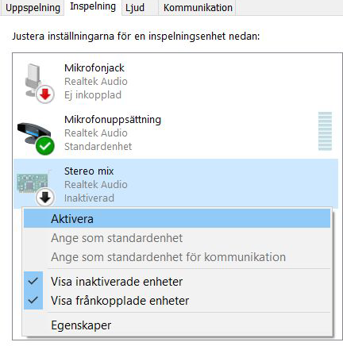
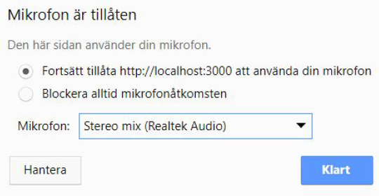

# Autoscribe help

## About

Autoscribe is a web app that lets you transcribe recorded audio files to text in the browser using [Javascript Speech Recognition API](https://developer.mozilla.org/en-US/docs/Web/API/SpeechRecognition).

In order for it to work properly you need to read the Setup section carefully.

This app was made by Jesper Engström as an educational thesis on the capacities of Javascript speech recognition. Essay can be read [here](./Jesper_Engstrom_Examensarbete.pdf) (in swedish).

## Requirements

Chrome browser v.25 or newer

## Setup

**PC**:

1. Allow for Autoscribe to use computer's microphone when prompted in the browser.

2. Activate sound card's Stereo Mix, or similar internal audio stream, as recording device (fig. 1).

  

3. Choose this device as microphone in the adress bar when Autoscribe is open and microphone access has been allowed.

  

**Mac**: TBA

## Features

* Audio files that are loaded into and "recorded" with the built in player becomes hyperlinked text, that automatically highlights when played and lets you jump to the corresponding place in the audio file.

* Timestamps can be inserted for individual transcribed "chunks".

* Transcriptions are exportable in markdown (.md) format.

* Transcription is stored in browser Local Storage to prevent it from being lost.

## Usage

Coming soon.

### Keyboard shortcuts

* `CTRL-Backspace` - When cursor is at the begining of a transcribed 'chunk'; Merges current chunk with the previous.

* `CTRL-Enter` - When cursor is at the begining of a word; splits the current chunks into two at that word. If the word is a green (timestamped) keyword, the new two chunks get more precise, individual start & end times. Otherwise the new chunk will have no unique timestamp = insertion of timestamp here is not possible.

## Source code

[Gitgub](https://github.com/jesperengstrom/autoscribe)